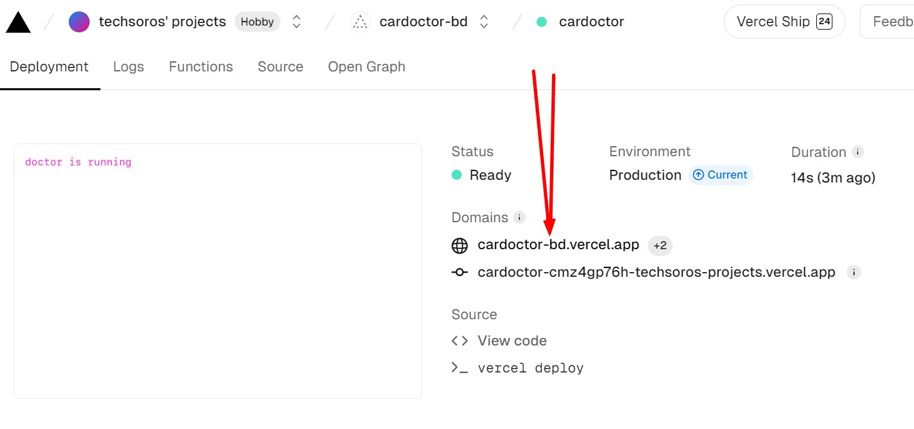

# B9A12-Battle-For-Supremacy

## [ Private Repo Link ( Client)](https://classroom.github.com/a/BBJEe3MV)

## [ Private Repo Link (Server) ](https://classroom.github.com/a/yyMxUX7W)

## 🚩: Updates
#### 📢if we bring any changes or update any of the assignment requirements we will mention them here. Ensure that you check this file twice a day during the assignment. We will mention the variant. 
```
0: No updates yet
1: Requirement 0010(ten) => Updates:
    ● Main Requirements 1c. and 
    ● Manage My post Page.
2: Requirement 0002(two) => Updates:
    ● Update a word mistake in the website theme.
    ● You have to implement search in all search page. Not in navbar
3: Requirement 0007(Seven) => Updates:
    ● Read The main requirement 10 again. Some clarifications are provided.
```
## What To Submit?
- Your assignment ID/Variant (The name of the pdf requirement file. Watch video for more)
- Your client-side code GitHub repository
- Your server-side code GitHub repository
- Your live website link
## Server Deployment steps

1. comment await commands outside api methods for solving gateway timeout error

```js
//comment following commands
await client.connect();
await client.db("admin").command({ ping: 1 });
```

2. create vercel.json file for configuring server

```json
{
  "version": 2,
  "builds": [
    {
      "src": "index.js",
      "use": "@vercel/node"
    }
  ],
  "routes": [
    {
      "src": "/(.*)",
      "dest": "index.js",
      "methods": ["GET", "POST", "PUT", "PATCH", "DELETE", "OPTIONS"]
    }
  ]
}
```

3. Add Your production domains to your cors configuration. Don't use the URL we have provided inside origin. Replace them with your own. Watch video 61-9 to 61-11 for solving server deployment issues.

```js
//Must remove "/" from your production URL
app.use(
  cors({
    origin: [
      "http://localhost:5173",
      "https://cardoctor-bd.web.app",
      "https://cardoctor-bd.firebaseapp.com",
    ],
    credentials: true,
  })
);
```

4. Let's create a cookie options for both production and local server

```js
const cookieOptions = {
  httpOnly: true,
  secure: process.env.NODE_ENV === "production",
  sameSite: process.env.NODE_ENV === "production" ? "none" : "strict",
};
//localhost:5000 and localhost:5173 are treated as same site.  so sameSite value must be strict in development server.  in production sameSite will be none
// in development server secure will false .  in production secure will be true
```

## now we can use this object for cookie option to modify cookies

```js
//creating Token
app.post("/jwt", logger, async (req, res) => {
  const user = req.body;
  console.log("user for token", user);
  const token = jwt.sign(user, process.env.ACCESS_TOKEN_SECRET);

  res.cookie("token", token, cookieOptions).send({ success: true });
});

//clearing Token
app.post("/logout", async (req, res) => {
  const user = req.body;
  console.log("logging out", user);
  res
    .clearCookie("token", { ...cookieOptions, maxAge: 0 })
    .send({ success: true });
});
```

5. Deploy to Vercel

```bash
vercel
vercel --prod
```
- After completed the deployment . click on inspect link and copy the production domain
- setup your environment variables in vercel
- check your public API




# Server Deployment Done